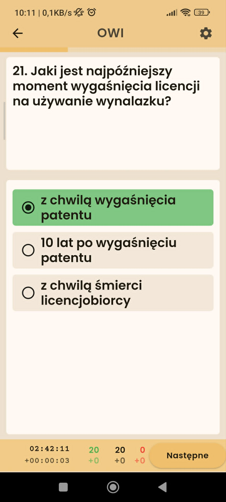
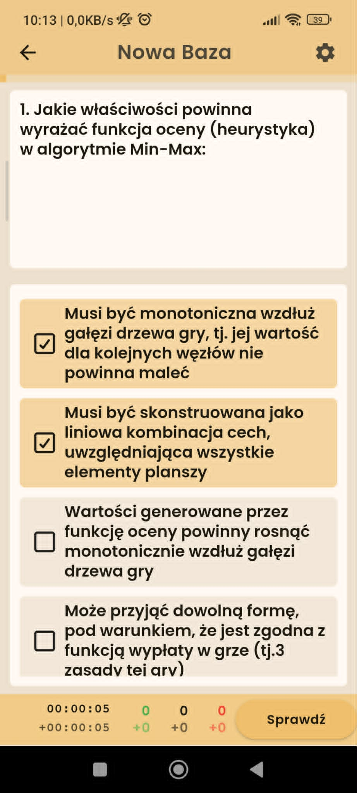
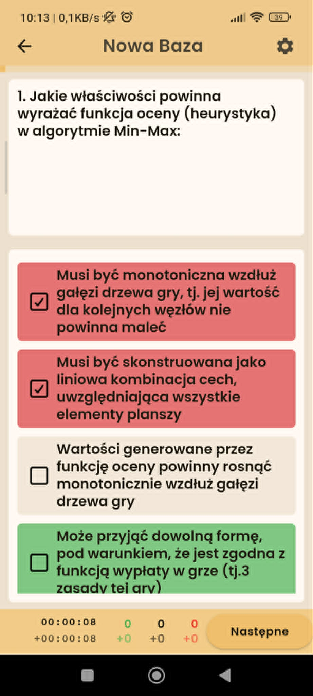
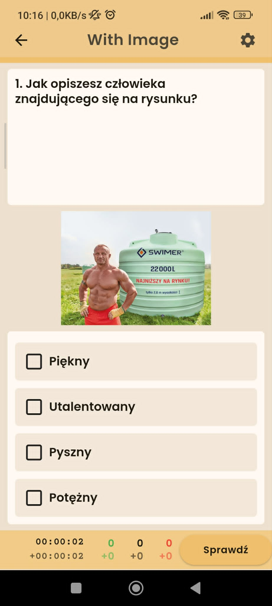
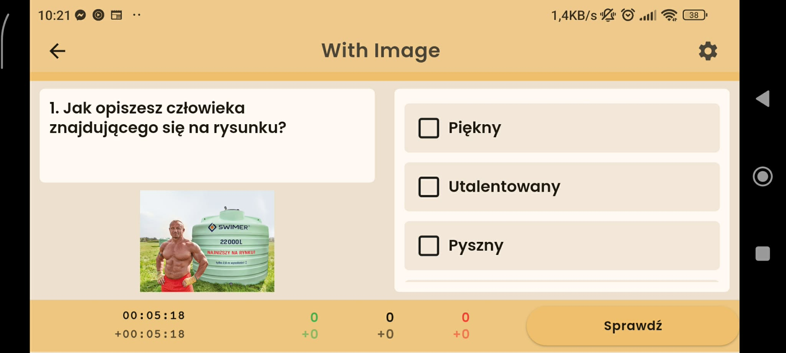
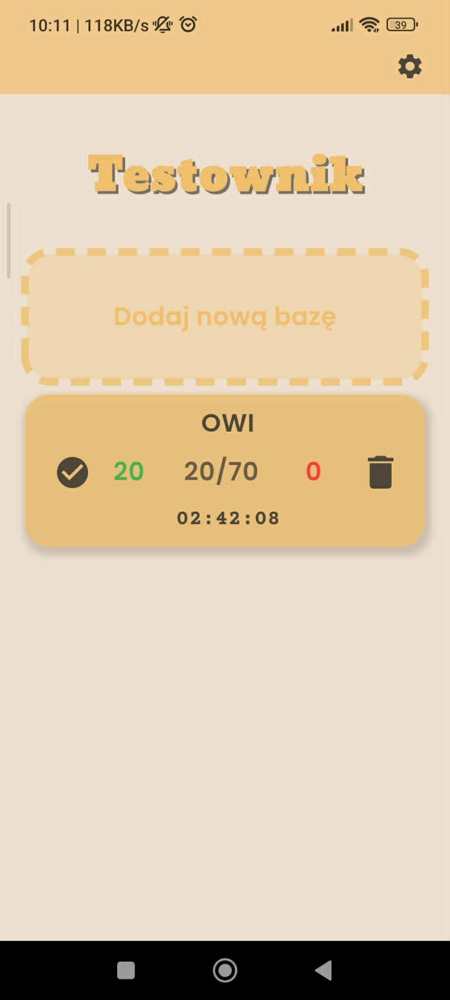
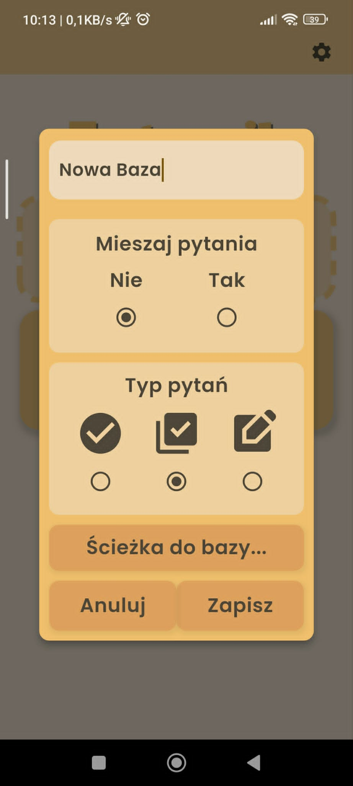
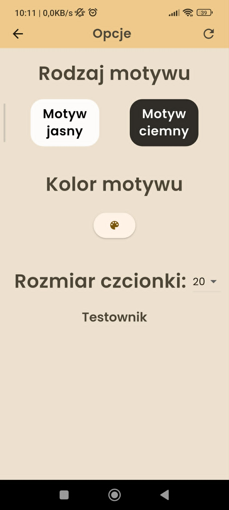

# Testownik – Advanced Offline Quiz & Assessment Engine

A responsive, feature-rich offline learning and exam simulation app built with Flutter and Dart. Designed for high performance, modularity, and maintainability by strictly following **SOLID**, **KISS**, **YAGNI**, and **DRY** engineering principles.

---

## 📱 App Previews

### Question Modes & Verification

|                                       Single Choice (Radio)                                       |                              Multiple Choice (Multi-select)                              |                                  Answer Validation Feedback                                  |
| :-----------------------------------------------------------------------------------------------: | :--------------------------------------------------------------------------------------: | :------------------------------------------------------------------------------------------: |
|  |  |  |

### Rich Media & Landscape Viewport

|                             Rich Media Content                              |                        Fullscreen Zoom Preview                         |                           Responsive Landscape Mode                           |
| :-------------------------------------------------------------------------: | :--------------------------------------------------------------------: | :---------------------------------------------------------------------------: |
|  |  |  |

### Database Import & Custom Theming

|                          Quiz Database Hub                          |                    Import & Configuration Modal                     |                        Dynamic Theming & Font Scaling                         |
| :-----------------------------------------------------------------: | :-----------------------------------------------------------------: | :---------------------------------------------------------------------------: |
|  |  |  |

---

## 🚀 Key Features

- **Multi-Format Assessment Engine:**
  - **Single & Multiple Choice:** Immediate evaluation, randomized answer shuffling, dynamic progression trackers, and session timers.
  - **Open-Ended / Self-Assessment:** Flashcard-style evaluation workflow allowing users to toggle and verify grading states (correct/incorrect) on tap.
  - **Rich Media Support:** In-app rendering of embedded imagery with dedicated full-screen zooming capabilities.
- **Custom File Parser & Local Data Storage:**
  - Custom file-ingestion mechanism parsing bespoke plain-text quiz databases into structured data models.
  - Local persistence powered by **SQLite (`sqflite`)** for persisting quiz history, answer records, timestamps, and overall completion metrics.
- **Reactive Configuration & Accessibility:**
  - Centralized state management via `Provider` enabling instant, rebuild-optimized app-wide state mutations.
  - Runtime theme switching (Dark/Light mode) paired with custom color palette customization (`flutter_colorpicker`).
  - Dynamic font-scale slider allowing real-time typographic adjustments across the entire widget tree.
  - Persistent user preferences via `shared_preferences`.
- **Multi-Modal Audio Feedback:**
  - Integrated low-latency sound cues (`audioplayers`) for interactive audio reinforcement on answer submissions.
- **Responsive Layout:**
  - Adaptive UI layouts delivering a consistent user experience across portrait and landscape orientations.

---

## 🛠️ Tech Stack & Dependencies

- **Framework:** Flutter 3.x / Dart SDK `^3.3.4`
- **Design Principles:** SOLID, KISS (Keep It Simple, Stupid), YAGNI (You Aren't Gonna Need It), DRY (Don't Repeat Yourself)
- **State Management:** `provider`
- **Local Persistence:** `sqflite`, `shared_preferences`, `path_provider`, `path`
- **File System & Hardware I/O:** `file_picker`, `permission_handler`
- **Audio Feedback:** `audioplayers`
- **UI & Custom Components:** `google_fonts`, `dotted_border`, `flutter_colorpicker`, `font_awesome_flutter`

---

## 🧩 Engineering & Code Design

The application emphasizes pragmatic, readable, and modular software design:

- **SOLID Design Patterns:** Single-responsibility service classes separating local database queries, audio playback, file system access, and custom file parsing.
- **KISS & YAGNI Approach:** Clean, direct architecture avoiding unnecessary abstraction layers while ensuring code maintainability and rapid feature scaling.
- **Custom Stream Ingestion:** Efficient string processing pipeline parsing non-standard database formats into domain objects before executing atomic database transactions.
- **Optimized Widget Trees:** Component breakdown ensuring targeted rebuild scopes via granular Provider listeners.

---

## 📦 Getting Started

### Prerequisites

- Flutter SDK `^3.3.4`
- Android Studio / VS Code with Flutter extension

### Installation

1. Clone the repository:

```bash
git clone [https://github.com/Tinczo/testownik.git](https://github.com/Tinczo/testownik.git)
cd testownik
```

2. Install project dependencies:

```bash
flutter pub get
```

3. Run the application:

```bash
flutter run
```

---

## 📄 License

This project is open-source and distributed under the [MIT License](https://www.google.com/search?q=LICENSE).
